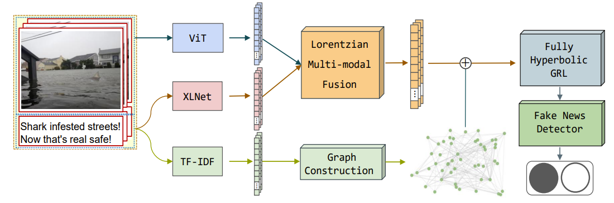

# MHR: A Multi-modal Hyperbolic Representation Framework for Fake News Detection
#### A **PyTorch** implementation of **MHR: A Multi-modal Hyperbolic Representation Framework for Fake News Detection**


## Abstract
The rapid growth of the internet has led to an alarming increase in the dissemination of fake news, which has had many negative effects on society. Various methods have been proposed for detecting fake news. However, these approaches suffer from several limitations. Firstly, most existing works only consider news as separate entities and do not consider the correlations between fake news and real news. Moreover, these works are usually conducted in the Euclidean space, which is unable to capture complex relationships between news, in particular the hierarchical relationships. To tackle these issues, we introduce a novel Multi-modal Hyperbolic Representation framework (MHR) for fake news detection. Specifically, we capture the correlations between news for graph construction to arrange and analyze different news. To fully utilize the multi-modal characteristics, we first extract the textual and visual information, and then design a Lorentzian multi-modal fusion module to fuse them as the node information in the graph. By utilizing the fully hyperbolic graph neural networks, we learn the graph’s representation in hyperbolic space, followed by a detector for detecting fake news. The experimental results on three real-world datasets demonstrate that our proposed MHR model achieves state-of-the-art performance, indicating the benefits of hyperbolic representation.
## Datasets
The datasets used in this paper are available for download on the public web. In the `data` folder of this repository, you can find the download links for the preprocessed data, which can be used by researchers to reproduce the code.
## Usage
Before training, run

```bash
source set_env.sh
```

This will create environment variables that are used in the code.

To run the experiments, simply download the datasets and put them in the `data` directory. Then run the corresponding training script, e.g.,

```bash
bash run.sh
```
